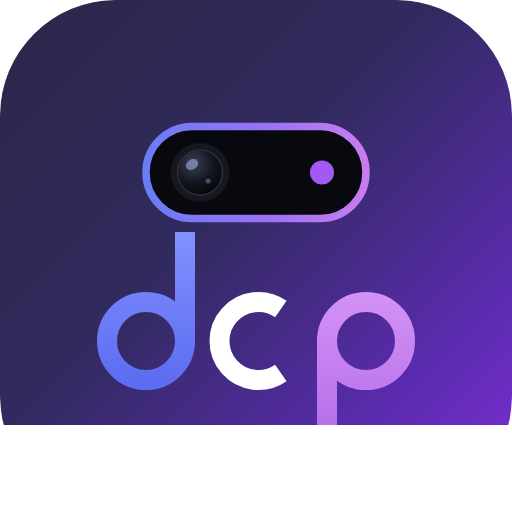

<div align="center">



# Dynamic Camera Punch

**A Dynamic Island for your Android punch-hole — running over every app on the phone.**

Not a mock-up and not a wallpaper: a system overlay that turns your camera cutout
into a live pill showing what is actually playing, ringing and charging.


</div>

---

## What it does

Switch the theme on and the island sits above every app on the device — home
screen, launcher, games, anything. It grows out of your camera cutout when
something happens and shrinks back into it when the moment passes.

The content is real:

| Source | What the island shows | Needs |
|---|---|---|
| **Media sessions** | The track that is actually playing, with working play/pause and skip | Notification access |
| **Calls** | The incoming caller, from the dialer's own notification | Notification access |
| **Timers & alarms** | Live countdown from the clock app | Notification access |
| **Navigation** | Turn-by-turn from your maps app | Notification access |
| **Any notification** | App icon, title, and its own actions in the expanded view | Notification access |
| **Charging** | Bolt and battery level the moment you plug in | *nothing* |
| **Battery low** | Level and warning | *nothing* |
| **Ringer** | Silent / vibrate / ring changes | *nothing* |
| **Headphones** | Connect and disconnect | *nothing* |

Grant nothing at all beyond the overlay permission and the last four still work.

### The two cutout shapes

| Variant A | Variant B |
|---|---|
| Pill fused to the top bezel — square shoulders, rounded chin, grows down out of the edge | Free-floating lens, clear of the bezels, fully rounded in every state |

Pick whichever matches your phone. **The camera never moves**: the overlay window
is centre-anchored and the lens is drawn at a fixed offset inside the island, so
no state change can slide the hole off the physical sensor.

### Gestures

| Gesture | Result |
|---|---|
| **Tap** | Play/pause, or open the app that posted it |
| **Touch & hold** | Expand into the detail view, with the screen dimmed behind |
| **Tap outside** | Collapse |
| **Swipe ← / →** | Swap the two concurrent activities |
| **Swipe ↓ / ↑** | Expand / collapse |

## The RAM dial

Pull the tab on the **right edge** of the screen while the theme is running. It
opens into a half-disc; drag along the arc to set the budget. Default **728 MB**,
and the maximum is whatever the device has minus a **1.5 GB reserve for Android**
that the dial can never eat into.

**Read this before you turn it up.** The island genuinely needs about 40 MB.
Everything above that is held as *ballast* — real, resident memory allocated off-heap
so the figure on the dial is a measurement rather than a decoration. That means:

- Raising the budget **does not make the island faster.** Nothing here is starved.
- A large resident footprint makes this process a *bigger* target for Android's
  low-memory killer, not a smaller one, and it evicts other apps from RAM so they
  cold-start instead of resuming.
- If the system hits critical memory pressure the ballast is **dropped
  immediately** and re-armed a minute later. Holding memory hostage while the
  phone thrashes would be indefensible.

The dial shows the budget and the *measured* footprint side by side, from the same
source `adb shell dumpsys meminfo` reads, so you can always see what is really
happening. If you want the island and nothing else, set it to the minimum.

## The live demonstration

The original sandbox is still in the app — every alert and activity, both cutout
shapes, driven by hand. It is a WebView worth roughly 80 MB, so:

**It will not open while the theme is running,** and starting the theme closes it.
It lives in its own `:demo` process, so shutting it down returns every byte to the
system instead of leaving a fattened heap inside the process that hosts the overlay.

## Install

```bash
adb install -r dist/dcp-release.apk
```

Then open the app and work down the setup list:

1. **Display over other apps** — required. This is the permission that lets the
   island draw on top of everything, and it is granted in Settings rather than by
   a dialog.
2. **Notification access** — optional but recommended; this is what makes the
   content real rather than just charging and ringer events.
3. **Show notifications** — Android requires an ongoing notification for a service
   that runs indefinitely. That notice is also how you turn the theme off.

Minimum Android 7.0 (API 24). ~120 KB. No network access.

## Permissions, and why each one is there

Nothing is requested speculatively — every entry is read by code in this app.

| Permission | Why |
|---|---|
| `SYSTEM_ALERT_WINDOW` | Draw the island over other apps. This *is* the product. |
| `FOREGROUND_SERVICE` + `…_SPECIAL_USE` | The island must survive you leaving the app. Android 14 requires a declared service type; a persistent UI overlay is not media or location, so `specialUse` with a written justification is the honest classification. |
| `POST_NOTIFICATIONS` | The ongoing notification the OS requires the service to have. |
| `RECEIVE_BOOT_COMPLETED` | Optional "start on boot", off by default. |
| `BIND_NOTIFICATION_LISTENER_SERVICE` | Read notifications and media sessions. User-granted in Settings, revocable at any time. |
| `com.dcp.punch.permission.INTERNAL` | Our own signature-level permission, guarding one private broadcast between our two processes. |

**Deliberately not requested:** `QUERY_ALL_PACKAGES` (icons come from the
notification itself), `READ_PHONE_STATE` (call state is read from the dialer's
notification instead), and `INTERNET` — the app has never made a network request
and cannot.

Notifications are read only. Nothing is dismissed, modified, stored or sent anywhere.

## How it is built

```
android/app/src/main/java/com/dcp/punch/
  DcpApp.java                 process singletons, memory-pressure handling
  BootReceiver.java           optional restart-on-boot
  data/
    Presentation.java         one thing the island can show
    IslandStore.java          state: an alert over a stack of ≤2 activities
    DcpNotificationListener.java   real notifications → presentations
    MediaMonitor.java         MediaSession → live track + transport controls
    SystemMonitor.java        charging / battery / ringer / headset broadcasts
  overlay/
    IslandService.java        foreground service, owns the two overlay windows
    IslandView.java           the island, drawn on Canvas
    SidePanelView.java        right-edge tab and the semicircular RAM dial
  mem/
    MemoryBudget.java         the ballast, the reserve, the live measurement
    Prefs.java                persisted settings
  ui/
    MainActivity.java         control panel
    DemoActivity.java         the WebView sandbox, in its own process

web/                          the demonstration — also opens in any browser
tools/                        Playwright/Pillow scripts that regenerate docs/
```

### Why the overlay is not a WebView

An overlay window has to be **exactly the size of its touchable content**, because
every pixel it covers is a pixel the app underneath stops receiving touches on. The
island changes size constantly, so its window is re-measured on every animation
frame. That is cheap for a custom `View` and ruinous for a WebView, which would
relayout its whole document 60 times a second — and cost ~80 MB besides.

So the overlay is native Canvas drawing, and the WebView survives only as the
demonstration. The geometry model is identical to the web build: measure the
content, animate `width`/`height`/`radius` between two numbers, and let one
interpolator — the same `cubic-bezier(.32,.72,0,1)` — carry the whole morph.

### The compact slots are symmetric on purpose

The camera gap has to land on the pill's horizontal centre, because that is where
the hole is drilled. A gap between two *unequal* slots does not sit in the middle,
so a long label would slide underneath the lens. Both slots are padded out to
`max(lead, trail)`, which puts the gap dead centre and gives the pill its balanced
look. When that would overflow the screen, the slots are capped and labels
ellipsise instead.

## Building

```bash
cd android
./gradlew assembleRelease      # JDK 17+, Android SDK platform 34 + build-tools 34.0.0
./gradlew lintDebug            # clean: zero errors
```

`syncWebAssets` mirrors `web/` into the APK on every build, so there is never a
second copy of the demo to keep in sync.

The release build is signed with the throwaway key in `android/keystore/`.
**Generate your own before distributing anything:**

```bash
keytool -genkeypair -keystore my.jks -alias mykey -keyalg RSA -keysize 2048 -validity 10950
# then point android/keystore.properties at it
```

## Compatibility and honest limits

- Android 7.0+ (API 24). Overlay windows above other apps require the user to
  grant "Display over other apps" — there is no way around that, by design.
- Some manufacturer skins (notably Xiaomi/MIUI and some Huawei builds) add their
  own extra "show on top" toggle and aggressively kill background services. If the
  island vanishes after a while, that is the vendor's battery manager, and the app
  has to be exempted there.
- **The APK has not been launched on a physical device or emulator** — the build
  environment has no KVM. It compiles, passes Android Lint with zero errors, and
  its structure and signature verify, but that is not the same as a runtime test.
  Treat the first install as the real smoke test.

## Licence

MIT — see [LICENSE](LICENSE).

Not affiliated with or endorsed by Apple. "Dynamic Island" and other Apple product
names are trademarks of Apple Inc., referenced only to describe the interaction
patterns this project reproduces. All artwork is original.
