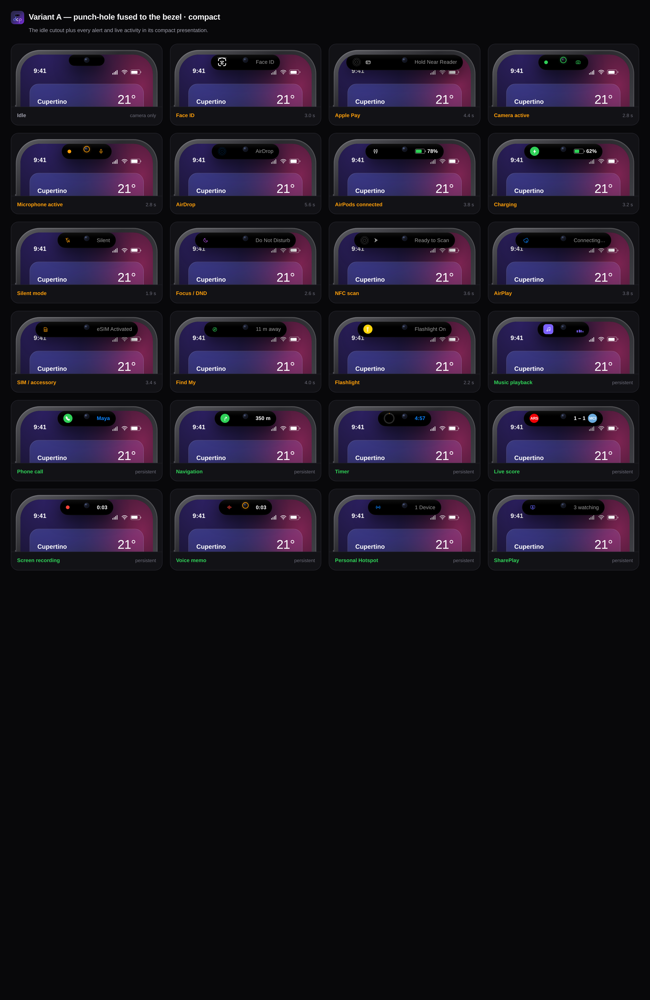
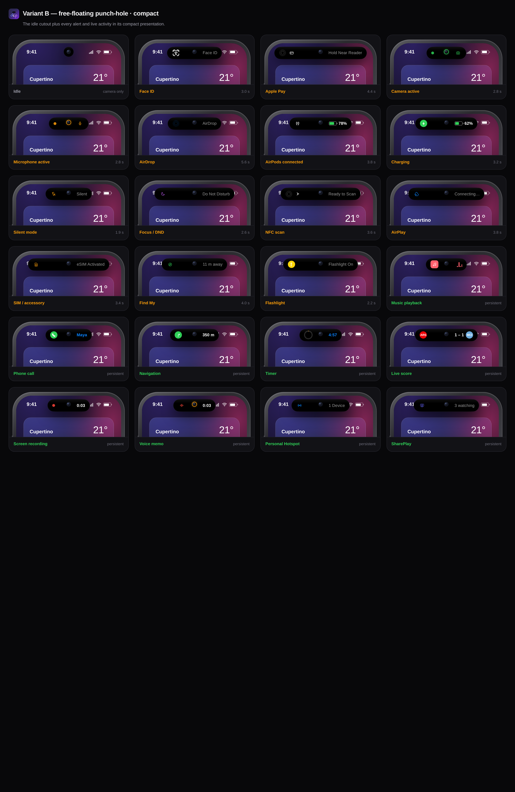
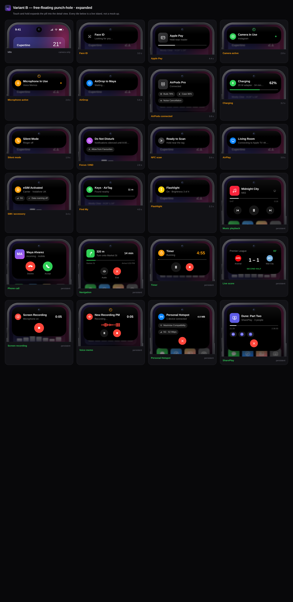
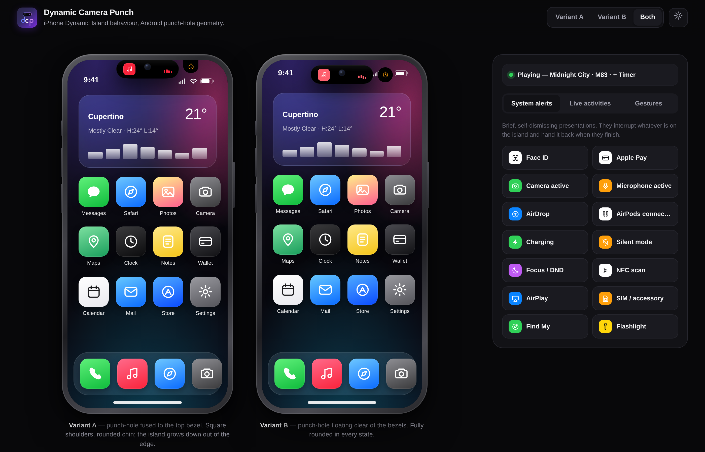

<div align="center">


# Dynamic Camera Punch

**An iPhone Dynamic Island, rebuilt for Android-style camera punch-holes.**
Two cutout geometries, every system alert and live activity, the real gestures —
in HTML, CSS and vanilla JavaScript with **zero dependencies**.


</div>

---

## What this is

The Dynamic Island works because the pill is *anchored to the hardware*. Everything
grows out of the camera cutout and shrinks back into it, so the sensor never appears
to move. This project reproduces that behaviour on two Android punch-hole shapes
instead of Apple's sensor bar:

| | Variant A | Variant B |
|---|---|---|
| **Cutout** | Pill fused to the top bezel | Free-floating lens, clear of the bezels |
| **Idle shape** | 86 × 27, square shoulders, rounded chin | 30 × 30 circle, 11 px below the edge |
| **Growth** | Downward out of the bezel; the top edge never rounds | Outward in every direction, fully rounded |
| **Status bar** | Pushed below the cutout | Flows either side of it |

Both morph into the same Dynamic Island pill when something is presented.

> **A note on Variant A.** Variant A stays welded to the bezel in *every* state
> rather than detaching into a floating pill when it activates. A cutout fused to
> the edge means the camera is physically drilled at the top edge — if the island
> detached and floated downward, it would carry the lens with it and the hole would
> appear to slide down the glass. Keeping it attached is what makes the illusion
> hold. The compact silhouette still reads as a Dynamic Island pill, because its
> top edge is hidden by the bezel.

## Run it

**Web** — no build step, no server:

```bash
open web/index.html          # or just double-click it
```

**Android** — install the prebuilt APK:

```bash
adb install -r dist/dcp-release.apk
```

It is a single `Activity` hosting a `WebView` over the same `web/` folder, drawing
into the display cutout so the demo's island lands where the real punch-hole is.
Minimum Android 7.0 (API 24), ~83 KB, no permissions, no network access.

## Features

### System alerts — brief, self-dismissing

Face ID · Apple Pay · camera privacy · microphone privacy · AirDrop · AirPods
connection + battery · charging + battery · Silent mode · Focus / Do Not Disturb ·
NFC scan · AirPlay · SIM / accessory · Find My · Flashlight

Alerts interrupt whatever is on the island and hand it back when they finish.
Multi-phase ones actually run their phases: Face ID scans then unlocks, Apple Pay
goes *hold near reader → confirm → done*, AirDrop counts up and reports **Sent**.
The countdown pauses while the island is held open, exactly like iOS.

### Live activities — persistent and interactive

Music playback · phone calls · turn-by-turn navigation · timers · live sports
scores · screen recording · voice memos · Personal Hotspot · SharePlay

Two run at once. The second one detaches into the **minimal indicator** — the
small satellite to the right of the pill, which fuses to it with a liquid bridge
when they are close. All nine keep running in the background: leave music playing,
start a timer, swap between them, and the track is exactly where it should be.

### Interactions

| Gesture | Result |
|---|---|
| **Tap** | Primary action — play/pause, answer a call, pause a timer |
| **Touch & hold** | Expands into the detail view |
| **Swipe ← / →** | Swaps the two concurrent activities; the pill follows your finger and springs back |
| **Swipe ↓ / ↑** | Expands / collapses |
| **Tap outside** | Collapses |
| **Keyboard** | <kbd>Enter</kbd> tap · <kbd>Space</kbd> expand · <kbd>←</kbd><kbd>→</kbd> swap · <kbd>Esc</kbd> collapse |

Everything is also reachable by keyboard, the island is a focusable `role="button"`,
and every presentation change is announced through an `aria-live` region.

## Screenshots

| | |
|---|---|
|  |  |
| **Variant A** — every alert and activity, bezel-fused cutout | **Variant B** — the same set, free-floating cutout |


*Expanded presentations. Every tile is a live island, not a mock-up.*


*The demo page, showing both variants driven in lock-step.*

## How the animation works

Four ideas do most of the work.

**1 — The geometry is content-driven, then written back in pixels.**
`island.js` renders the presentation, measures it, and writes plain `px` values onto
`width` / `height` / `border-radius`. Every state change is therefore a transition
between two numbers, which lets one easing curve (`cubic-bezier(.32,.72,0,1)` — a
very fast departure that glides to a stop) carry the entire morph. Measurement uses
`getBoundingClientRect()`, not `offsetWidth`: the latter rounds *down*, and pinning a
44.6 px label to 44 px makes it ellipsise itself for no reason.

**2 — The compact slots are symmetric, because the lens is centred.**
The camera gap has to land on the pill's horizontal centre — that is where the hole
is drilled. A gap between two *unequal* slots does not sit in the middle, so a long
trailing label would slide underneath the lens. Both slots are padded out to
`max(lead, trail)`, which puts the gap dead centre and gives the pill its balanced
look. When that would overflow the screen, the slots are capped and the labels
ellipsise instead.

**3 — The island is drawn twice, and the copy underneath is gooey.**
A blob layer holds nothing but black shapes and runs through an SVG filter that
blurs them and then slams the alpha channel back to a hard edge:

```xml
<feGaussianBlur stdDeviation="7"/>
<feColorMatrix values="… 0 0 0 26 -12"/>   <!-- re-harden alpha -->
```

Two nearby black shapes fuse with a liquid bridge. The crisp surface layer sits on
top carrying the actual content, so the goo never blurs a pixel of text. This is what
makes the minimal indicator feel like it is *pulling away from* the pill rather than
appearing next to it.

**4 — Gestures get a spring, states get a curve.**
A CSS curve has a fixed duration, which is right for a state change and wrong for
anything a finger drives — a released swipe has to start from wherever the gesture
left it, at whatever speed it was going. `spring.js` is a damped harmonic oscillator
(`a = -k·(x - target) - c·v`) integrated at a fixed 1/120 s sub-step so it behaves
identically on 60 Hz and 120 Hz displays. The gesture hands it the pointer's exit
velocity on release.

## Embedding it

The island has no idea what music or Face ID are; it only knows the presentation
contract in `registry.js`. To use it in your own page:

```html
<link rel="stylesheet" href="css/theme.css">
<link rel="stylesheet" href="css/phone.css">
<link rel="stylesheet" href="css/island.css">

<script src="js/icons.js"></script>
<script src="js/spring.js"></script>
<script src="js/phone.js"></script>
<script src="js/registry.js"></script>
<script src="js/island.js"></script>
```

```js
const phone  = DI.Phone.create('a', document.body);   // 'a' or 'b'
const island = new DI.Island(phone, {
  onChange: isl => console.log(isl.current()?.def.status(isl.current().data))
});

island.present('music');      // add an activity (max 2, oldest drops off)
island.present('timer');      // the second detaches as the minimal indicator
island.swap('left');          // promote the satellite
island.expand();              // or .collapse() / .toggle()
island.present('faceid');     // an alert interrupts, then hands the island back
island.dismiss('timer');
island.clear();
```

Adding a presentation of your own means adding one object to `DI.Registry`:

```js
{
  id: 'download', kind: 'activity', accent: '#0a84ff', icon: 'airdrop',
  label: 'Download',
  data:     () => ({ pct: 0 }),
  tick:     (d, c) => { d.pct = Math.min(100, d.pct + c.dt / 80); },
  compact:  d => ({ lead: '…', trail: `<span class="di-text" data-f="p">${d.pct|0}%</span>` }),
  expanded: d => '…',
  sync:     (el, d) => { el.querySelector('[data-f=p]').textContent = (d.pct|0) + '%'; },
  tap:      (d, c) => c.dismiss()
}
```

`tick` advances the model ~5×/s; `sync` patches live values **in place**. Never
re-render on a tick — rebuilding the DOM restarts the CSS animations and makes the
equalisers stutter. Call `c.rerender()` only for a genuine phase change.

Theming is CSS custom properties in `theme.css`: cutout sizes (`--cut-a-w`,
`--cut-b-w`, …), motion (`--ease-island`, `--dur-morph`), and the island's own
palette (`--island-bg`, `--island-ring`, `--island-shadow`). Dark is the default;
`[data-theme="light"]` only re-declares what changes. `prefers-reduced-motion` is
honoured — states still change, they just snap.

## Project layout

```
web/                        the demo — open index.html, no build step
  index.html
  css/  theme.css           design tokens, reset, light/dark
        phone.css           device frame, wallpaper, status bar, home screen
        island.css          the island: geometry, variants, content components
        demo.css            the harness around it
  js/   icons.js            inline SVG library
        spring.js           damped-harmonic integrator for gesture physics
        phone.js            device-frame markup (shared by demo + gallery)
        registry.js         every alert and activity
        island.js           the engine: state, geometry, gestures, heartbeat
        app.js              demo wiring
  assets/logo.svg           app mark

android/                    WebView wrapper (AGP 8.5, minSdk 24, no AndroidX)
  app/src/main/java/…/MainActivity.java
  app/src/main/res/         adaptive + legacy launcher icons, themes
  keystore/                 throwaway demo signing key

tools/  gallery.html        contact sheet of every state → docs/*.png
        stage.html          scripted timeline → docs/preview.gif
        capture.js          Playwright driver for both
        make-gif.py         palette + GIF assembly

dist/                       prebuilt APKs
docs/                       generated screenshots and the preview GIF
```

## Building

**APK** — needs a JDK 17+ and an Android SDK with platform 34 / build-tools 34.0.0:

```bash
cd android
./gradlew assembleRelease      # → app/build/outputs/apk/release/app-release.apk
./gradlew assembleDebug        # debug-signed, installs alongside the release build
```

`syncWebAssets` mirrors `web/` into the APK on every build, so there is never a second
copy of the demo to keep in sync. The release build is signed with the throwaway key
in `android/keystore/` — **generate your own before shipping anything**:

```bash
keytool -genkeypair -keystore my.jks -alias mykey -keyalg RSA -keysize 2048 -validity 10950
# then point android/keystore.properties at it
```

**Docs** — regenerate every screenshot and the GIF from the live demo:

```bash
npm i -D playwright && pip install Pillow
node tools/capture.js            # or: node tools/capture.js gif
```

## Compatibility

Chrome / Edge 88+, Safari 15.4+, Firefox 103+, and Android WebView 88+ — the floor is
set by `color-mix()` and `:focus-visible`. Pointer Events cover mouse, touch and pen
from one code path. The gooey filter degrades gracefully: without it the satellite
simply appears beside the pill instead of pulling away from it.

## Licence

MIT — see [LICENSE](LICENSE).

Not affiliated with or endorsed by Apple. "Dynamic Island", "Face ID", "Apple Pay",
"AirDrop", "AirPods", "AirPlay", "SharePlay" and "Find My" are trademarks of Apple
Inc., referenced here only to describe the interaction patterns this project
reproduces. All artwork is original.
